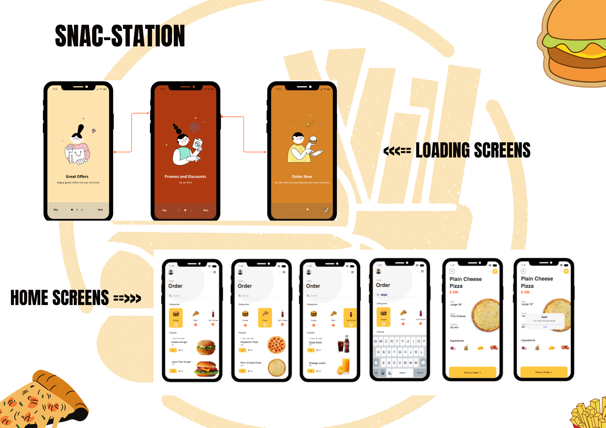

# Food Order App

`React Native` `UI`

<p align="center" flexdirection="coloumn">

</p>
 
```

Thanks for being here!

```

## You can watch the video below.

`Video Demo`

- https://drive.google.com/file/d/11CiBvO0HfsWUKPUZfLpa57Y6eKIsruBk/view?usp=sharing

`Documentation (Word Document)`

- https://docs.google.com/document/d/1BSskNkcoiif4S_H7zFnzwZz5fK7LCkh9GaIOmHIATr4/edit?usp=sharing

`Presentation (Powerpoint)`

- https://docs.google.com/presentation/d/19-pBFH3Ca4dZa1H0tJ600T5H1zRWkSs5/edit?usp=sharing&ouid=109108887119013813692&rtpof=true&sd=true

## Hello!

`Email - You can message me through here`

- ramonnapa28@gmail.com

`Github Profile`

- https://github.com/ramonnapa28
```
